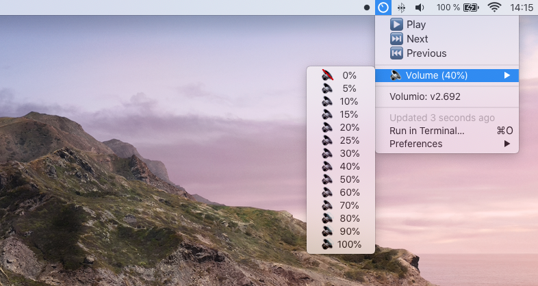

# Volumio BitBar Plugin

[BitBar](https://getbitbar.com) plugin to control the Volumio player.

## Installation & Setup

* Install BitBar per [instructions](https://getbitbar.com)
* Copy `volumio.5s.sh` from the repository to your BitBar plugins directory

Optional, edit `volumio.5s.sh` and set your Volumio ip address `VOL_IP`.

## Features

* Play / Pause
* Switch to next / previous queue item
* Set volume
* View actual version (link to local Volumio web interface)

The plugin is set to reload every 5 seconds.

## Troubleshooting

Ensure the plugin is executable by running `chmod +x volumio.5s.sh`

## License
